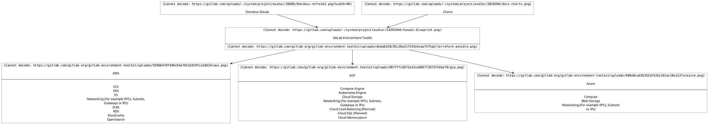

# GitLab Environment Toolkit

The GitLab Environment Toolkit (`GET`) is a collection of tools, based on [Terraform](https://www.terraform.io/) and [Ansible](https://docs.ansible.com/ansible/latest/index.html), to enable the deployment and operation of a base production GitLab environment at scale based on our [Reference Architectures](https://docs.gitlab.com/ee/administration/reference_architectures) that can be built upon accordingly.

Created and maintained by the GitLab Quality Engineering Enablement team, the Toolkit supports the following features:

- Support for deploying all [Reference Architectures](https://docs.gitlab.com/ee/administration/reference_architectures) sizes dynamically from [1k](https://docs.gitlab.com/ee/administration/reference_architectures/1k_users.html) to [50k](https://docs.gitlab.com/ee/administration/reference_architectures/50k_users.html).
- Support for deploying Cloud Native Hybrid variants of the Reference Architectures (AWS & GCP only at this time).
- GCP, AWS and Azure (Omnibus) [cloud provider support](TECHNICAL_DESIGN.md#supported-cloud-providers)
- Upgrades
- Release and nightly Omnibus builds support
- Advanced search with Elasticsearch
- Geo support
- Container Registry support
- Zero Downtime Upgrades support
- Built-in optional Load Balancing and Monitoring (Prometheus, Grafana) setup
- SSL / TLS support (either direct or via hooks)
- Alternative sources (Cloud Services, Custom Servers) for select components (Load Balancers, PostgreSQL, Redis)
- On Prem Support (Ansible)
- Custom Config / Tasks / Files support

## Before You Start

It's recommended that users have a good working knowledge of Terraform, Ansible, GitLab administration as well as running applications at scale in production before using the Toolkit.

While the Toolkit does aim to streamline the process notably, the same underlying challenges still apply when running applications at scale. For users who aren't in this position, our [Professional Services](https://about.gitlab.com/services/#implementation-services) team offers implementation services, but for those who want a more managed solution long term, it's recommended to instead explore our other offerings such as [GitLab SaaS](https://docs.gitlab.com/ee/subscriptions/gitlab_com/) or [GitLab Dedicated](https://about.gitlab.com/dedicated/).

If you are interested in using the Toolkit, it's strongly recommended that you independently review the Toolkit in full to ensure it meets your requirements, especially around [security](docs/environment_post_considerations.md#security). [Further manual setup](docs/environment_post_considerations.md) will also still likely be required based on your specific requirements.

## Requirements

The requirements for the Toolkit are as follows:

- GitLab version: `14.0.0` and upwards.
- OS: Ubuntu 20.04+, Debian 11, RHEL 8, Amazon Linux 2
  - At this time the Toolkit only supports clean OS installations. It may work with existing installations, but this is not currently being tested.
  - Admin access to the OS is also required by GET to install various dependencies
  - ARM based hardware is supported for Omnibus environments
- Types of environment: The Toolkit is designed to deploy the official GitLab [Reference Architectures](https://docs.gitlab.com/ee/administration/reference_architectures) (Standard or Cloud Native Hybrid) as environments.
  - The Toolkit requires [NFS to propagate certain files](docs/environment_advanced.md#nfs-options). This can be on a dedicated node, or it will dynamically set this up on other nodes as required.

## Documentation

- [GitLab Environment Toolkit - Quick Start Guide](docs/environment_quick_start_guide.md)
- [GitLab Environment Toolkit - Preparing the environment](docs/environment_prep.md)
- [GitLab Environment Toolkit - Provisioning the environment with Terraform](docs/environment_provision.md)
- [GitLab Environment Toolkit - Configuring the environment with Ansible](docs/environment_configure.md)
- [GitLab Environment Toolkit - Advanced - Custom Config / Tasks / Files, Data Disks, Advanced Search, Container Registry and more](docs/environment_advanced.md)
- [GitLab Environment Toolkit - Advanced - Cloud Native Hybrid](docs/environment_advanced_hybrid.md)
- [GitLab Environment Toolkit - Advanced - Component Cloud Services / Custom (Load Balancers, PostgreSQL, Redis)](docs/environment_advanced_services.md)
- [GitLab Environment Toolkit - Advanced - SSL](docs/environment_advanced_ssl.md)
- [GitLab Environment Toolkit - Advanced - Network Setup](docs/environment_advanced_network.md)
- [GitLab Environment Toolkit - Advanced - Geo](docs/environment_advanced_geo.md)
- [GitLab Environment Toolkit - Advanced - Monitoring](docs/environment_advanced_monitoring.md)
- [GitLab Environment Toolkit - Upgrades (Toolkit, Environment)](docs/environment_upgrades.md)
- [GitLab Environment Toolkit - Considerations After Deployment - Backups, Security](docs/environment_post_considerations.md)
- [GitLab Environment Toolkit - Troubleshooting](docs/environment_troubleshooting.md)

### Config Examples

[Full config examples are available for select Reference Architectures](examples).

## How To Use

The Toolkit's Terraform and Ansible modules can be used in various ways depending on your requirements:

- Terraform - Source (git checkout), [Docker](docs/environment_provision.md#4-run-the-gitlab-environment-toolkits-docker-container-optional), [Module Registry](docs/environment_provision.md#terraform-module-registry)
- Ansible - Source (git checkout), [Docker](docs/environment_configure.md#3-run-the-gitlab-environment-toolkits-docker-container-optional), [Collection](docs/environment_configure.md#running-with-ansible-collection-optional)

Refer to the docs above for full instructions on each.

## How It Works

At a high level the Toolkit is designed to be as straightforward as possible. A high level overview of how it works is as follows:

- Machines and associated infrastructure are _provisioned_ as per the [Reference Architectures](https://docs.gitlab.com/ee/administration/reference_architectures) with Terraform. Part of this provisioning includes adding specific labels / tags to each machine for Ansible to then use to identify.
- Machines are _configured_ with Ansible. Through identifying each machine by its Labels, Ansible will intelligently go through them in the correct installation order. On each it will install and configure Omnibus to set up the intended component as required. The Ansible scripts have been designed to handle certain dynamic setups depending on what machines have been provisioned (e.g. an environment without Elasticsearch, or a 2k environment with a smaller amount of nodes). Additional tasks are also performed as required such as setting GitLab config through Rails or Load Balancer / Monitoring setup.

## Troubleshooting

Please refer to our [Troubleshooting guide](docs/environment_troubleshooting.md) if you are having issues deploying an environment with the Toolkit.

[Technical support](https://about.gitlab.com/support/) for troubleshooting issues is only available for the current Toolkit major version.

## Feature Requests

Feature Requests can be raised in [our tracker](https://gitlab.com/gitlab-org/gitlab-environment-toolkit/-/issues). Please check beforehand to see if a request already exists (and upvote in that case).

### Features that won't be covered

Due to complexities, permutations or areas best left to be configured directly we do not plan to include the following:

- Cloud accounts management
- Observability stack beyond Prometheus and Grafana
- Direct OmniAuth and Email support
- Full GitLab agent server for Kubernetes (KAS) setup

The above areas are better tackled via [Custom Config](docs/environment_advanced.md#custom-config).

### Contributions

This project accepts contributions to existing features. Refer to the [Contributing guide](CONTRIBUTING.md) for more information.

## Licensing

Requires [GitLab Premium](https://about.gitlab.com/pricing/) or above.

Released under the [GitLab EE license](LICENSE).
