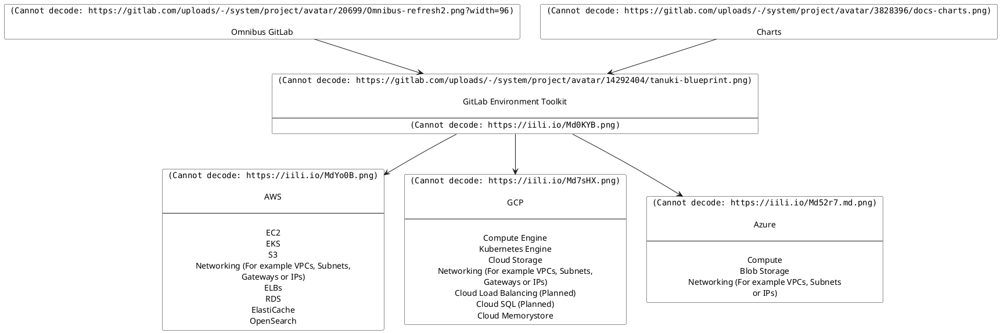

# GitLab Environment Toolkit

>>>
Requires [GitLab Premium](https://about.gitlab.com/pricing/) or above.
Released under the [GitLab EE license](LICENSE).

GET configures a base GitLab environment based on the Reference Architectures that can be built upon accordingly.

Customers are very welcome to trial and evaluate GET today. However, it's recommended that you do independently review the Toolkit to ensure it meets your requirements, especially around [security](docs/environment_post_considerations.md#security), while also being aware of any current [key limitations](#missing-features-to-be-aware-of). For production environments [further manual setup](docs/environment_post_considerations.md) will be required based on your specific requirements.
>>>

The GitLab Environment Toolkit (`GET`) is a collection of tools to deploy and operate production GitLab instances based on our [Reference Architectures](https://docs.gitlab.com/ee/administration/reference_architectures), including automation of common day 2 tasks.

Created and maintained by the GitLab Quality Engineering Enablement team, the Toolkit - built with [Terraform](https://www.terraform.io/) and [Ansible](https://docs.ansible.com/ansible/latest/index.html) - supports provisioning and configuring machines and other related infrastructure respectively with the following features:

- Support for deploying all [Reference Architectures](https://docs.gitlab.com/ee/administration/reference_architectures) sizes dynamically from [1k](https://docs.gitlab.com/ee/administration/reference_architectures/1k_users.html) to [50k](https://docs.gitlab.com/ee/administration/reference_architectures/50k_users.html).
- Support for deploying Cloud Native Hybrid variants of the Reference Architectures (AWS & GCP only at this time).
- GCP, AWS and Azure (Omnibus) [cloud provider support](TECHNICAL_DESIGN.md#supported-cloud-providers)
- Upgrades
- Release and nightly Omnibus builds support
- Advanced search with Elasticsearch
- Geo support
- Zero Downtime Upgrades support
- Built in optional Load Balancing and Monitoring (Prometheus, Grafana) setup
- SSL / TLS support (either direct or via hooks)
- Alternative sources (Cloud Services, Custom Servers) for select components (Load Balancers, PostgreSQL, Redis)
- On Prem Support (Ansible)

By design the Toolkit is meant to be **_one for all_** and aims to deploy a production GitLab environment that will be a good base that can be customized further depending on your requirements.

## Requirements

Note that the Toolkit currently has the following requirements (with related issues to increase support further):

- GitLab version: `13.2.0` (Omnibus) / `13.6.0` (Cloud Native Hybrid) and upwards.
- OS: Ubuntu 18.04+, RHEL 8, Amazon Linux 2
  - At this time the Toolkit only supports clean OS installations. It may work with existing installations, but this is not currently being tested.
  - Admin access to the OS is also required by GET to install various dependencies
- Types of environment: The Toolkit is designed to deploy the official GitLab [Reference Architectures](https://docs.gitlab.com/ee/administration/reference_architectures) (Standard or Cloud Native Hybrid) as environments.
  - The Toolkit requires NFS to propagate certain files. This can be on a dedicated node, or it will dynamically set this up on other nodes as required.

## Documentation

- [GitLab Environment Toolkit - Quick Start Guide](docs/environment_quick_start_guide.md)
- [GitLab Environment Toolkit - Preparing the environment](docs/environment_prep.md)
- [GitLab Environment Toolkit - Provisioning the environment with Terraform](docs/environment_provision.md)
- [GitLab Environment Toolkit - Configuring the environment with Ansible](docs/environment_configure.md)
- [GitLab Environment Toolkit - Advanced - Custom Config / Tasks / Files, Data Disks, Advanced Search and more](docs/environment_advanced.md)
- [GitLab Environment Toolkit - Advanced - Cloud Native Hybrid](docs/environment_advanced_hybrid.md)
- [GitLab Environment Toolkit - Advanced - Component Cloud Services / Custom (Load Balancers, PostgreSQL, Redis)](docs/environment_advanced_services.md)
- [GitLab Environment Toolkit - Advanced - SSL](docs/environment_advanced_ssl.md)
- [GitLab Environment Toolkit - Advanced - Network Setup](docs/environment_advanced_network.md)
- [GitLab Environment Toolkit - Advanced - Geo](docs/environment_advanced_geo.md)
- [GitLab Environment Toolkit - Advanced - Monitoring](docs/environment_advanced_monitoring.md)
- [GitLab Environment Toolkit - Upgrades (Toolkit, Environment)](docs/environment_upgrades.md)
- [GitLab Environment Toolkit - Legacy Setups](docs/environment_legacy.md)
- [GitLab Environment Toolkit - Considerations After Deployment - Backups, Security](docs/environment_post_considerations.md)
- [GitLab Environment Toolkit - Troubleshooting](docs/environment_troubleshooting.md)

### Config Examples

[Full config examples are available for select Reference Architectures](examples).

## How To Use

The Toolkit's Terraform and Ansible modules can be used in various ways depending on your requirements:

- Terraform - Source (git checkout), [Docker](docs/environment_provision.md#4-run-the-gitlab-environment-toolkits-docker-container-optional), [Module Registry](docs/environment_provision.md#terraform-module-registry)
- Ansible - Source (git checkout), [Docker](docs/environment_configure.md#3-run-the-gitlab-environment-toolkits-docker-container-optional), [Collection](docs/environment_configure.md#running-with-ansible-collection-optional)

Refer to the docs above for full instructions on each.

## How It Works

At a high level the Toolkit is designed to be as straightforward as possible. A high level overview of how it works is as follows:

- Machines and associated infrastructure are _provisioned_ as per the [Reference Architectures](https://docs.gitlab.com/ee/administration/reference_architectures) with Terraform. Part of this provisioning includes adding specific labels / tags to each machine for Ansible to then use to identify.
- Machines are _configured_ with Ansible. Through identifying each machine by its Labels, Ansible will intelligently go through them in the correct installation order. On each it will install and configure Omnibus to set up the intended component as required. The Ansible scripts have been designed to handle certain dynamic setups depending on what machines have been provisioned (e.g. an environment without Elasticsearch, or a 2k environment with a smaller amount of nodes). Additional tasks are also performed as required such as setting GitLab config through Rails or Load Balancer / Monitoring setup.

## Direction

The GitLab Environment Toolkit will be the best and easiest way to deploy multi-node production instances of GitLab, and operate them with very high service levels. It will come pre-packaged with best practices in areas such as secrets and least-privileged access. It will be what GitLab internally uses to deploy their own production instances of GitLab, and shared in a [source-available](https://en.wikipedia.org/wiki/Source-available_software#GitLab_Enterprise_Edition_License_(EE_License)) way for collaboration with other large deployments of GitLab.

GET will support both VM (Omnibus), hybrid, and cloud native (GitLab Helm chart and Operator) deployments of GitLab as per the Reference Architectures. How certain operations are carried out will differ, as we will choose the best implementation method for each type. For example, the Operator will likely handle most of the day 2 operations for cloud native deployments, while terraform and ansible will likely handle these for VM-based deployments. Today only VM and hybrid are supported.

### What we plan to include

We include everything necessary for the deployment and operation of GitLab on major cloud providers. This includes all required dependencies such as Postgres, as well as optional ones like Elasticsearch. We will provide flexibility in selecting cloud managed services when available, and the Omnibus-based deployments, for services like Postgres. GET is intended to be opinionated, but still flexible enough for most use cases.

### What we do not plan to include

Currently, we do not plan to include:

- Cloud accounts management
- Observability stack beyond Prometheus and Grafana
- Direct Omniauth and Email support (see [Custom Config](docs/environment_advanced.md#custom-config))

## Missing features to be aware of

There are a few key features which are not supported yet, which are important to keep in mind.

- [Some cloud provider services](https://gitlab.com/gitlab-org/gitlab-environment-toolkit/-/issues/74) such as managed PostgreSQL or Redis. AWS and other currently supported services can be seen on the [relevant docs page](docs/environment_advanced_services.md).

Our upcoming work, sorted by tentative milestone, can be viewed on [our development board](https://gitlab.com/gitlab-org/gitlab-environment-toolkit/-/boards). Please note that the issues slated for any upcoming release or milestone are subject to change and may not meet the planned time frames.

## Issues or Feature Requests

Everyone is welcome to open new Issues or Feature Requests (or to upvote existing ones) over on [our tracker](https://gitlab.com/gitlab-org/gitlab-environment-toolkit/-/issues).

Further information:

<!-- markdownlint-disable proper-names -->
- Work in progress can also be seen on our [board](https://gitlab.com/gitlab-org/gitlab-environment-toolkit/-/boards).
- Issues relating directly to the [Reference Architectures can be found in their own project](https://gitlab.com/gitlab-org/quality/reference-architectures).
- Issues relating to the previous incarnation of Performance Environment Builder can be found on [the old generic performance issue tracker](https://gitlab.com/gitlab-org/quality/performance/-/issues?scope=all&utf8=%E2%9C%93&state=closed).
- To contact the team you can also reach out on Slack [#gitlab-environment-toolkit](https://gitlab.slack.com/archives/C01DE8TA545) channel.
<!-- markdownlint-restore proper-names -->
